# audit — ERD

Audit trail, change history, logs, traces, events. AUDIT, AUDITFAULT, *History, *Change, PORTALLOG, Trace, EventData.

18 tables in this domain (showing up to 60 by row count). PK = primary key, FK = foreign key.

```mermaid
erDiagram
    PORTALLOG {
        int PLID PK
        datetime2 PLDate
    }
    TaskMonitorEvent {
        int id PK
    }
    AUDIT {
        int AFaultid FK
        int AUnum FK
        int ID PK
        int auserid FK
        datetime ADate
        nvarchar atablename
    }
    Trace {
        bigint id PK
    }
    Feed {
        int Fid PK
        int Forgid FK
        int fareaint FK
        nvarchar fuserusername
        nvarchar fusersdesc
        nvarchar fuseraareadesc
    }
    WorkflowHistory {
        int whid PK
        int whfaultid FK
        int whactionnumber FK
        datetime whmoveddate
        datetime WHtargetdate
        datetime whoverridedate
    }
    EventData {
        int id PK
        int eventId FK
    }
    UserChange {
        int UCid PK
        int UCUid FK
        nvarchar UCUsername
    }
    Event {
        int id PK
        int unum FK
        int uid FK
        int status
        datetime nextretrydate
        datetime LastAttemptDate
    }
    ConfigCommit {
        int CCid PK
        int CCunum FK
        nvarchar CCuname
    }
    AUDITEVENT {
        int aid PK
        nvarchar aauditname
        nvarchar ausername
    }
    LicenceChange {
        int LCid PK
        int LCUserId FK
    }
    PREPAYHISTORY {
        int ppid PK
        int ppareaint FK
        datetime ppdate
        nvarchar ppDesc
        datetime PPInvoiceDate
    }
    AuditPasswordField {
        int apfid PK
        datetimeoffset apfdate
    }
    CONNCHANGE {
        int DCID PK
    }
    ItemStockHistory {
        int ISHid PK
        int ISHiid FK
        int ISHchid FK
        int ISHfaultid FK
        datetime ISHdate
    }
    LICENCEHISTORY {
        int LHid PK
        int LHareaint FK
        datetime LHdate
        nvarchar LHDesc
        datetime LHStartDate
    }
    TaskMonitor {
        int id PK
        datetime last_update
    }
    Event ||--o{ EventData : "eventId"
```

