# auth — ERD

Identity & access. **UNAME** = internal agents (Unum), **USERS** = end-users / contacts (Uid), NHD_IDENTITY_* = OAuth/OpenID tables, AgentLogin = login history.

66 tables in this domain (showing up to 60 by row count). PK = primary key, FK = foreign key.

```mermaid
erDiagram
    AgentLogin {
        int ALid PK
        int ALUnum FK
    }
    NHD_IDENTITY_Authorization {
        nvarchar Id PK
        nvarchar ApplicationId FK
        nvarchar Status
    }
    USERS {
        int Uid PK
        nvarchar uusername
        nvarchar uemail
        nvarchar UTitle
    }
    NHD_IDENTITY_Token {
        nvarchar Id PK
        nvarchar ApplicationId FK
        nvarchar AuthorizationId FK
        nvarchar Status
        datetimeoffset CreationDate
        datetimeoffset ExpirationDate
    }
    NHD_UserClaims {
        int Id PK
        nvarchar UserId FK
    }
    NHD_RoleClaims {
        int Id PK
        nvarchar RoleId FK
    }
    AccessControl {
        int ACid PK
        int ACunum FK
        int ACuid FK
    }
    NHD_User {
        nvarchar ID PK
        int Uid FK
        int Unum FK
        nvarchar Email
        nvarchar NormalizedEmail
        nvarchar NormalizedUserName
    }
    AgentCheckIn {
        int ACIid PK
        int ACIunum FK
        int ACIstatus
    }
    ImpersonationRequest {
        int IRid PK
        int IRunum FK
        int IRuid FK
    }
    UNAMEANALYZER {
        int UAPUnum PK
        int UAPAPID PK
    }
    UserRoleLink {
        int URLid PK
        int URLuid FK
    }
    unamenotificationlink {
        int UNLunum FK
    }
    UNAMEFIELD {
        int UFUnum FK
        int ufid PK
    }
    UnameDepartment {
        int UDid PK
        int UDunum FK
    }
    UNAMESECTION {
        int USunum FK
        int USID PK
    }
    NHD_Identity_ApplicationScope {
        int Id PK
    }
    UNAMENOTIFICATION {
        int UNid PK
        int UNunum FK
        int UNuid FK
        nvarchar unname
    }
    NHD_Tokens {
        nvarchar UserId PK
        nvarchar LoginProvider PK
        nvarchar Name PK
    }
    NHD_UserRoles {
        nvarchar UserId PK
        nvarchar RoleId PK
    }
    NHD_IDENTITY_Application {
        nvarchar Id PK
        nvarchar DisplayName
        datetime apiKey1LastUseDate
        datetime apiKey2LastUseDate
    }
    UNAMETICKETHISTORY {
        int UTHID PK
        int UTHFaultID FK
        int UTHUnum FK
        datetime UTHStartDate
        datetime UTHEndDate
    }
    UNAME {
        int Unum PK
        nvarchar uname
        int UShowDate
        int UShowUsername
    }
    COMPANY {
        int Cnum PK
        nvarchar cdesc
        nvarchar ccontractcode
        nvarchar ccontractdesc
    }
    UnameEventSubscription {
        int UESid PK
        int UESUnum FK
    }
    NHD_DeviceInfo {
        nvarchar Id PK
        nvarchar UserId FK
        nvarchar DeviceName
        nvarchar AppName
        datetime LastUpdated
    }
    NHD_Roles {
        nvarchar Id PK
        nvarchar Name
        nvarchar NormalizedName
    }
    UnameAppointment {
        int upid PK
        int upunum FK
    }
    UnameCustom {
        int ucid PK
        int ucunum FK
    }
    UNAMECALENDARFILTERS {
        int UCFID PK
        int UCFUnum FK
        nvarchar UCFName
    }
    PORTALRESETPASSWORD {
        int PRID PK
        int PRUID FK
        datetime PRDate
    }
    UNAMEREQUESTTYPE {
        int URTUnum FK
        int URTid PK
    }
    UNAMETEMPLATE {
        int UTid PK
        nvarchar UTdesc
        int UTportnumber
        int UTReceiveTimeSheetUsageEmail
    }
    NHD_Identity_ApplicationRole {
        int Id PK
    }
    UserCompany {
        int company_id PK
        int user_id PK
    }
    USERHASH {
        int UHID PK
        int UHUID FK
    }
    AccessToken {
        int Tid PK
        int Tuserid FK
        int Ttechid FK
        datetime Texpirydate
        nvarchar Tanonusername
    }
    ADFSIDS {
        int ADFSID PK
        datetime ADFSExpiryDate
    }
    AgentStatusChangeLog {
        int ASGLid PK
        int ASGLunum FK
    }
    AgentStatusReassignMapping {
        int ASRMid PK
    }
    APIAPPLICATION {
        int APIAid PK
        nvarchar APIAappname
    }
    APIToken {
        int Id PK
    }
    NHD_IDENTITY_Scope {
        nvarchar Id PK
        nvarchar Name
        nvarchar DisplayName
    }
    NHD_UserLogins {
        nvarchar LoginProvider PK
        nvarchar ProviderKey PK
        nvarchar UserId FK
        nvarchar ProviderDisplayName
    }
    UNAMEACTIVITY {
        int UAnum PK
        int UAid PK
    }
    UNAMEAREA {
        int UAunum PK
        int UAPrefArea PK
    }
    UNAMEAREAPOPUP {
        int UAPOPid PK
        int UAPOPunum FK
        datetime UAPOPdate
        int UAPOPreadstatus
    }
    UnameAreaRestriction {
        int UARunum FK
    }
    UnameButton {
        int UBid PK
        int UBUnum FK
    }
    UnameCostTracking {
        int uctId PK
        datetime uctStartDate
        datetime uctEndDate
    }
    UNAMEEXPENSERESTRICTION {
        int UEUnum PK
        int UERUnum PK
    }
    UNAMEHASH {
        int UNHID PK
        int UNHUnum FK
    }
    UNAMEHIDEFIELD {
        int UHid PK
        int UHunum FK
        int UHFIid FK
    }
    UnameHolidayAllowance {
        int UHAid PK
    }
    UnameIntegration {
        int UIid PK
        int UIunum FK
    }
    UnameLoadBalanceLimit {
        int ULBLid PK
        int ULBLunum FK
    }
    UNAMEORGANISATION {
        int UOUnum PK
        int UOORid PK
    }
    UnamePresenceRule {
        int UPRid PK
    }
    UnamePresenceSubscription {
        int UPSid PK
        int UPSUnum FK
    }
    UNAMEQUALIFICATION {
        int UQid PK
        int UQunum FK
        datetime UQdate
        datetime uqenddate
    }
    UNAME ||--o{ AgentLogin : "ALUnum"
    NHD_IDENTITY_Application ||--o{ NHD_IDENTITY_Authorization : "ApplicationId"
    NHD_IDENTITY_Application ||--o{ NHD_IDENTITY_Token : "ApplicationId"
    NHD_IDENTITY_Authorization ||--o{ NHD_IDENTITY_Token : "AuthorizationId"
    NHD_User ||--o{ NHD_UserClaims : "UserId"
    NHD_Roles ||--o{ NHD_RoleClaims : "RoleId"
    UNAME ||--o{ AccessControl : "ACunum"
    USERS ||--o{ AccessControl : "ACuid"
    USERS ||--o{ NHD_User : "Uid"
    UNAME ||--o{ NHD_User : "Unum"
    UNAME ||--o{ AgentCheckIn : "ACIunum"
    UNAME ||--o{ ImpersonationRequest : "IRunum"
    USERS ||--o{ ImpersonationRequest : "IRuid"
    UNAME ||--o{ UNAMEANALYZER : "UAPUnum"
    USERS ||--o{ UserRoleLink : "URLuid"
    UNAME ||--o{ unamenotificationlink : "UNLunum"
    UNAME ||--o{ UNAMEFIELD : "UFUnum"
    UNAME ||--o{ UnameDepartment : "UDunum"
    UNAME ||--o{ UNAMESECTION : "USunum"
    UNAME ||--o{ UNAMENOTIFICATION : "UNunum"
    USERS ||--o{ UNAMENOTIFICATION : "UNuid"
    USERS ||--o{ NHD_Tokens : "UserId"
    NHD_Roles ||--o{ NHD_UserRoles : "RoleId"
    NHD_User ||--o{ NHD_UserRoles : "UserId"
    UNAME ||--o{ UNAMETICKETHISTORY : "UTHUnum"
    UNAME ||--o{ UnameEventSubscription : "UESUnum"
    USERS ||--o{ NHD_DeviceInfo : "UserId"
    UNAME ||--o{ UnameAppointment : "upunum"
    UNAME ||--o{ UnameCustom : "ucunum"
    UNAME ||--o{ UNAMECALENDARFILTERS : "UCFUnum"
    USERS ||--o{ PORTALRESETPASSWORD : "PRUID"
    UNAME ||--o{ UNAMEREQUESTTYPE : "URTUnum"
    COMPANY ||--o{ UserCompany : "company_id"
    USERS ||--o{ UserCompany : "user_id"
    USERS ||--o{ USERHASH : "UHUID"
    USERS ||--o{ AccessToken : "Tuserid"
    UNAME ||--o{ AgentStatusChangeLog : "ASGLunum"
    NHD_User ||--o{ NHD_UserLogins : "UserId"
    UNAME ||--o{ UNAMEAREA : "UAunum"
    UNAME ||--o{ UNAMEAREAPOPUP : "UAPOPunum"
    UNAME ||--o{ UnameAreaRestriction : "UARunum"
    UNAME ||--o{ UnameButton : "UBUnum"
    UNAME ||--o{ UNAMEEXPENSERESTRICTION : "UEUnum"
    UNAME ||--o{ UNAMEEXPENSERESTRICTION : "UERUnum"
    UNAME ||--o{ UNAMEHASH : "UNHUnum"
    UNAME ||--o{ UNAMEHIDEFIELD : "UHunum"
    UNAME ||--o{ UnameIntegration : "UIunum"
    UNAME ||--o{ UnameLoadBalanceLimit : "ULBLunum"
    UNAME ||--o{ UNAMEORGANISATION : "UOUnum"
    UNAME ||--o{ UnamePresenceSubscription : "UPSUnum"
    UNAME ||--o{ UNAMEQUALIFICATION : "UQunum"
```

