# billing — ERD

Invoices (**INVOICEHEADER** + INVOICEDETAIL), taxes, budgets, charges, currencies, quotes.

38 tables in this domain (showing up to 60 by row count). PK = primary key, FK = foreign key.

```mermaid
erDiagram
    InvoiceChange {
        int ICid PK
    }
    INVOICEDETAIL {
        int IDid PK
        int IdIHid FK
        int IDCHID FK
        int IDFaultid FK
        nvarchar IDItem_Code
        nvarchar IDNominal_Code
        nvarchar IDTax_Code
    }
    INVOICEHEADER {
        int IHid PK
        int IHaarea FK
        int IHsitenumber FK
        int IHuid FK
        int IHchid FK
        int IHFaultid FK
        nvarchar IHInvoiceNumber
        nvarchar IH3rdPartyInvoiceNumber
        nvarchar IHname
    }
    QUOTATIONDETAIL {
        int QDid PK
        nvarchar QDProductCode
        nvarchar QDDesc
        datetime QDStartDate
    }
    InvoicePayment {
        int IPid PK
        int IPIHid FK
        datetime IPDate
        float IPAmount
        int IPStatus
    }
    InvoiceHeaderMerge {
        int IHMid PK
        int IHMihid FK
        int IHMchid FK
        datetime IHMscheduleDate
    }
    ORDERLINE {
        int OLid PK
        int OLseq PK
        int olfaultid FK
        nvarchar OLDesc
        datetime OLStartDate
        nvarchar OLSupplierPartCode
    }
    QUOTATIONHEADER {
        int QHid PK
        int QHfaultID FK
        int QHUserID FK
        int QHUnum FK
        int QHstatus
        datetime QHDate
        datetime QHExpiryDate
    }
    Tax {
        int TaxID PK
        nvarchar TaxCode
        nvarchar TaxQboCode
        nvarchar TaxQboCodeName
    }
    ORDERHEAD {
        int OHid PK
        int OHfaultid FK
        int OHCHid FK
        int ohuserid FK
        int OHstatus
        nvarchar OHusername
        nvarchar OHponumber
    }
    CHARGERATE {
        int CRid PK
        datetime CRstartdate
        datetime crexpirydate
    }
    BudgetType {
        int BTid PK
        nvarchar BTname
    }
    CURRENCY {
        int Cid PK
        nvarchar Cdesc
        nvarchar Ccode
        nvarchar Cname
    }
    BillingAudit {
        int BAID PK
        int BAUnum FK
        nvarchar BADesc
    }
    BillingPlanCriteria {
        int BPCid PK
        int BPCFiid FK
        nvarchar BPCTableName
        nvarchar BPCFieldName
    }
    BILLINGREPORT {
        int AIAreaid PK
        int AIseq PK
        int AIFaultID FK
        int AITaxCode
        ntext AIdesc
        nvarchar AIBPDesc
    }
    CHARGECD {
        nvarchar Chargecode PK
        float Defamount
    }
    ChargeRateArea {
        int craid PK
        int craarea FK
    }
    CurrencyHistory {
        int CHID PK
        datetime CHEndDate
    }
    GOODSINHEAD {
        int GHid PK
        int GHstatus
        nvarchar GHponumber
        datetime GHdate
    }
    InvoiceCreationTrace {
        int id PK
    }
    INVOICECSVLAYOUT {
        int ILID PK
        int ILSeq PK
        nvarchar ILName
    }
    InvoiceDetail_Metadata {
        bigint Idid PK
    }
    InvoiceDetailAssetMeters {
        int IDAMid PK
    }
    InvoiceDetailComponents {
        int IDCid PK
        int IDCihid FK
    }
    InvoiceDetailMeterTiers {
        int IDMid PK
    }
    InvoiceDetailProRata {
        int IDPRid PK
        int IDPRUserId FK
        datetime IDPRDate
    }
    InvoiceDetailQuantity {
        int IDQid PK
    }
    InvoiceDetailQuantityCriteria {
        int idqcid PK
        nvarchar idqctablename
        nvarchar idqcfieldname
    }
    InvoiceHeader_Metadata {
        bigint Ihid PK
    }
    QUOTATIONDETAILTEMPLATE {
        int QDid PK
        nvarchar QDProductCode
        nvarchar QDDesc
        datetime QDStartDate
    }
    QuotationHeaderPdf {
        int QHPid PK
        int QHPatid FK
    }
    RECEIPTNOTEDETAIL {
        int RNDID PK
        int RNDHID PK
        nvarchar RNDSerialNumber
    }
    RECEIPTNOTEHEADER {
        int RNHID PK
        int RNHFaultID FK
        datetime RNHDateCreated
        datetime RNHDate
    }
    TaxRelation {
        int TaxId1 PK
        int TaxId2 PK
    }
    TaxRule {
        int TRLID PK
        nvarchar TRLName
    }
    TaxRuleConditions {
        int TRCID PK
    }
    TaxRuleResult {
        int TRRid PK
        decimal TRRTaxAmount
        nvarchar TRRTaxCode
        datetime TRRDateCreated
    }
    INVOICEHEADER ||--o{ INVOICEDETAIL : "IdIHid"
    INVOICEHEADER ||--o{ InvoicePayment : "IPIHid"
    INVOICEHEADER ||--o{ InvoiceHeaderMerge : "IHMihid"
    INVOICEHEADER ||--o{ InvoiceDetailComponents : "IDCihid"
    Tax ||--o{ TaxRelation : "TaxId1"
    Tax ||--o{ TaxRelation : "TaxId2"
```

