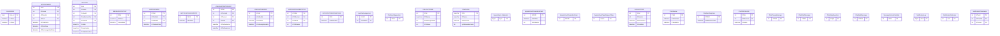

# comms — ERD

Appointments / calendar (**APPOINTMENT**), calls, chat, meetings, SMS.

30 tables in this domain (showing up to 60 by row count). PK = primary key, FK = foreign key.

```mermaid
erDiagram
    CALENDAR {
        date date_id PK
        datetime F1Date
        datetime F2Date
    }
    APPOINTMENT {
        int APid PK
        int APunum FK
        int APFaultid FK
        int APUid FK
        datetime APStartDate
        datetime APEndDate
        datetime APExchangeStartDate
    }
    CALLLOG {
        int CLid PK
        int CLunum FK
        int CLfaultid FK
        int CLactionnumber FK
        int CLuserid FK
        datetime CLdate
        nvarchar CLusername
        nvarchar CLdiallednumber
    }
    MESSAGECONTENT {
        int MSid PK
        nvarchar MSDesc
        datetime msenddate
    }
    LIVECHATMSG {
        int LCMid PK
        int LCMchatid PK
        int LCMfaultid FK
        datetime LCMvalueDate
    }
    NOTIFICATIONCONTENT {
        int NCid PK
        nvarchar NCName
    }
    LIVECHATPARTICIPANT {
        int LCPid PK
        int LCPchatid PK
        int LCPunum FK
        int LCPuid FK
        nvarchar LCPothername
        nvarchar LCPotheremail
    }
    LIVECHATHEADER {
        int LCHid PK
        int LCHfaultid FK
        nvarchar LCHname
        datetime LCHlastupdatedate
    }
    LIVECHATONLINESTATUS {
        int LCOSid PK
        int LCOSunum FK
        int LCOSuid FK
        int LCOSstatus
    }
    NOTIFICATIONCONDITIONS {
        int NCid PK
        nvarchar nctablename
    }
    LiveChatAssignment {
        int LCAid PK
        int LCAchatid FK
    }
    ChatInputSuggestion {
        int CISid PK
    }
    CALLOUTCOME {
        int COid PK
        nvarchar COName
        int COChangeStatus
        int COStatus
    }
    ChatProfile {
        nvarchar CPid PK
        nvarchar CPname
        nvarchar CPbotname
        bit cphideheadername
    }
    Appointment_Metadata {
        bigint Apid PK
    }
    AppointmentReminderEmails {
        int AREID PK
        datetime AREDate
        int AREStatus
    }
    AppointmentReminderSetup {
        int ARSID PK
    }
    AppointmentTypeRequestType {
        int atratid FK
    }
    CALLHISTORY {
        int CAid PK
        int CAstatus
        nvarchar CAusername
        datetime CAcalldate
    }
    ChatBanner {
        int CBid PK
        datetime CBstartdate
        datetime CBenddate
    }
    ChatMatchingData {
        int CMDid PK
        datetime CMDdatecreated
    }
    CHATMESSAGE {
        int CMid PK
        int CMtounum FK
        datetime CMdate
    }
    ChatPopupMessage {
        int CPMid PK
    }
    ChatStartMessage {
        int CSMid PK
    }
    ChatStepQuestion {
        int CSQid PK
    }
    ChatWaitMessage {
        int CWMid PK
    }
    MessageContentVariable {
        int MVid PK
    }
    NotificationLog {
        bigint NLid PK
    }
    NotificationOutcome {
        int noid PK
    }
    NotificationTimestamp {
        int NTunid PK
        int NTFaultid PK
        int NTUnum PK
    }
```
