# contracts — ERD

Recurring contracts (**CONTRACTHEADER** + CONTRACTDETAIL), plans, schedules, billing rules.

15 tables in this domain (showing up to 60 by row count). PK = primary key, FK = foreign key.

```mermaid
erDiagram
    CONTRACTPLAN {
        int CPid PK
        nvarchar CPDesc
    }
    CONTRACTDETAIL {
        int CDid PK
        int CDseq PK
        int CDChargeCode
        nvarchar cdbillingplandesc
        datetime cdenddate
    }
    CONTRACTHEADER {
        int CHid PK
        int CHFaultid FK
        int chuserid FK
        datetime CHstartdate
        datetime CHenddate
        float CHPeriodChargeAmount
    }
    CONTRACT {
        int CNid PK
        nvarchar CNContractCode
        nvarchar CNContractDesc
        datetime CNstartdate
    }
    ContractCI {
        int CCid PK
    }
    ContractHeaderContract {
        int CHCid PK
        int CHCCHid FK
    }
    CONTRACTPERIODHISTORY {
        int CPid PK
        int CPseq PK
        datetime CPPeriodStartDate
        nvarchar CPInvoiceNumber
        float CPAmount
    }
    CONTRACTPLANHISTORY {
        int PHid PK
        int PHPeriod PK
        int PHBillingPlan PK
    }
    ContractRule {
        int crlid PK
        nvarchar crlname
        datetime crloutcome_end_date
    }
    ContractSchedule {
        int CSCHID PK
        int CSSeq PK
        int CSUnum FK
        float CSAmount
        datetime CSDate
    }
    ContractSchedulePlan {
        int CSPID PK
        int CSPCHID FK
        int CSPUnum FK
        datetime CSPDate
    }
    ContractSite {
        int CSID PK
        int CSCHID FK
        int CSSITENUM FK
    }
    CONTRACTTEMPLATEDETAIL {
        int CTCHid FK
        int CTid2 PK
        int CTChargeCode
        nvarchar cdbillingplandesc
    }
    CONTRACTTEMPLATEHEADER {
        int CHid PK
        nvarchar CHdesc
        datetime CHPrepayRecurringChargeNextDate
        bit CHBillForRecurringPrePayAmount
    }
    ContractUser {
        int CUid PK
        int CUchid FK
        int CUuid FK
        datetime cuenddate
    }
    CONTRACTHEADER ||--o{ ContractHeaderContract : "CHCCHid"
    CONTRACTHEADER ||--o{ ContractSchedule : "CSCHID"
    CONTRACTHEADER ||--o{ ContractSchedulePlan : "CSPCHID"
    CONTRACTHEADER ||--o{ ContractSite : "CSCHID"
    CONTRACTHEADER ||--o{ CONTRACTTEMPLATEDETAIL : "CTCHid"
    CONTRACTHEADER ||--o{ ContractUser : "CUchid"
```

