# crm — ERD

Clients (**AREA**) and their **SITEs**, address books, opportunities, marketing, campaigns. AREA.Aarea = client id; SITE.Ssitenum = site id.

36 tables in this domain (showing up to 60 by row count). PK = primary key, FK = foreign key.

```mermaid
erDiagram
    MailCampaignLog {
        int MCLid PK
        int MCLuid FK
        int MCLunum FK
        int MCLfaultid FK
    }
    MarketingOpen {
        int MOid PK
        int MOuid FK
        nvarchar MOuemail
        datetime MOdate
    }
    BulkEmailUser {
        int id PK
        int bulkemailid FK
        int userid FK
    }
    ADDRESSSTORE {
        int ASID PK
    }
    SITE {
        int Ssitenum PK
        nvarchar sdesc
        int SRefNumber
        nvarchar StimezoneName
    }
    AREA {
        int Aarea PK
        nvarchar aareadesc
        datetime Aannouncedate
        int Aconfirmemail
    }
    AreaAzureTenant {
        int AATid PK
        nvarchar AATAzureTenantName
    }
    MailCampaignEmail {
        int MCEid PK
        int MCEstatus
    }
    MailCampaign {
        int MCid PK
        int MCstatus
        nvarchar MCstatusdesc
        bit MChalocreated
    }
    BulkEmail {
        int id PK
        int befaultid FK
        int beactionnumber FK
        datetime2 datecreated
        int status
        datetime NextRetryDate
    }
    OPPCLOSURECATEGORYFIELDS {
        int OCID PK
        int OCfiid FK
        int OCfcode
    }
    AREANOTE {
        int ANid PK
        int anihid FK
        int ANFaultId FK
        int anuid FK
        datetime ANDate
        datetime ANNextCallDate
    }
    MarketingUnsubscribe {
        int MUid PK
        int MUuid FK
    }
    ORGANISATION {
        int ORid PK
        nvarchar ORname
        nvarchar OREmail
        nvarchar ORLogoFilename
    }
    SITECONTACT {
        int SCid PK
        int SCuid FK
    }
    ACCOUNTSINTERFACE {
        int AIAreaid PK
        int AIseq PK
        int AIFaultID FK
        int AITaxCode
        ntext AIdesc
        int AIInvoiceNumber
    }
    ADDRESSBOOK {
        int abid PK
        int abunum FK
        nvarchar abdisplayname
    }
    AOV {
        int aovCnum PK
        int aovBudgetCode PK
    }
    AreaChangeFreeze {
        int acfid PK
    }
    AREAFIELD {
        int AFid PK
        int AFfiid FK
    }
    AREAITEM {
        int AMID PK
        nvarchar AMdesc
        datetime AMStartDate
        nvarchar AMInvoiceNumber
    }
    AREAORGANISATION {
        int AOArea PK
        int AOORid PK
    }
    AREAPOPUP {
        int APOPid PK
        datetime apopstartdate
        datetime apopenddate
    }
    AREAREQUESTTEMPLATE {
        int ARTID PK
        int ARTSTDID FK
    }
    AREAREQUESTTYPE {
        int ARarea PK
        int ARRT PK
    }
    AreaRequestTypeRule {
        int ARTRid PK
    }
    AreaSectionDetail {
        int ASDid PK
    }
    AreaSite {
        int AreaID PK
        int SiteID PK
    }
    AreaToDO {
        int atdarea PK
        int atdtdid PK
        int atdtdseq PK
    }
    CUSTOMERVERSIONHISTORY {
        int CVHid PK
        datetime CVHdate
    }
    OrganisationField {
        int OFid PK
        int OFfiid FK
    }
    ORGANISATIONREQUESTTYPE {
        int ORTorid PK
        int ORTrtid PK
    }
    SalesMailbox {
        int smid PK
        nvarchar smname
        nvarchar smgoogleemail
    }
    SalesMailboxDetail {
        int smdid PK
        int smdunum FK
        nvarchar smdname
    }
    SITEBUDGET {
        int sbId PK
        int sbssitenum FK
        int sbBudgetCode
        float sbAmount
        datetime sbStartDate
    }
    SITEVISITLOCATION {
        int SVID PK
        nvarchar SVDesc
    }
    BulkEmail ||--o{ BulkEmailUser : "bulkemailid"
    SITE ||--o{ AreaSite : "SiteID"
    SITE ||--o{ SITEBUDGET : "sbssitenum"
```

