# integrations — ERD

Per-vendor integration tables — RMM (Datto, NinjaOne, NCentral, Atera, Auvik, Continuum, Kaseya, Syncro, Domotz, Addigy, Automate), PSA peers (ConnectWise, Autotask, ServiceNow, Freshdesk, Zendesk, Jira), monitoring (Splunk, Sentinel, NewRelic, Pagerduty, Orion, Splunk OnCall, OpsGenie), billing (Stripe, Sage, Xero, QuickBooks, Pax8, Chargebee), comms (Twilio, Slack, Teams, RingCentral), social (Twitter, Facebook), webhooks, OAuth, vendor alert tables.

65 tables in this domain (showing up to 60 by row count). PK = primary key, FK = foreign key.

```mermaid
erDiagram
    IntegratorTrace {
        int id PK
    }
    IntegrationRequest {
        int IRID PK
        int IRResultCode
    }
    IncomingWebhookAttempt {
        bigint id PK
        int status
        datetime attemptdate
        int errorcode
    }
    Outgoing {
        int id PK
        int status
        datetime nextretrydate
        datetime LastAttemptDate
    }
    WebhookEvent {
        uniqueidentifier WHEid PK
        int WHEstatus
        int WHEresponsestatus
        datetime WHElogretentionpolicydeletiondate
    }
    IncomingWebhook {
        int id PK
        datetime resourcedatadate
        datetime lastattemptdate
        int status
    }
    AzureLicences {
        int ALid PK
        nvarchar ALlicname
    }
    OutboundIntegrationMethodValue {
        int OIMVid PK
        nvarchar OIMVdesc
    }
    IntegrationError {
        int IEid PK
        nvarchar IEEntityName
        datetime IEDate
    }
    IntegrationConfiguration {
        int ICid PK
        nvarchar icwebhookusername
        datetime iclastupdate
    }
    AzureDelta {
        int ADid PK
        datetime ADLastUpdated
    }
    IntegrationFieldMapping {
        int IFMid PK
        int IFMfiid FK
        nvarchar IFMfiname
        nvarchar IFMThirdPartyName
        nvarchar IFMThirdPartyFriendlyName
    }
    AzureADMapping {
        int AMid PK
        nvarchar AMTenantName
        nvarchar AMGroupName
    }
    OutboundIntegrationMethod {
        int OIMid PK
        int OIMoiid FK
        nvarchar OIMname
    }
    Webhook {
        uniqueidentifier WHid PK
        nvarchar WHname
        nvarchar WHbasicusername
        nvarchar WHlibraryLicenceName
    }
    OutboundIntegrationMethodValueMapping {
        int OIMVMid PK
    }
    OutboundIntegration {
        int OIid PK
        nvarchar OIname
        nvarchar OIbearerName
        nvarchar OIheaderName
    }
    AzureADConnection {
        int ACid PK
        nvarchar ACName
        bit ACReceiveSubscriptionUpdated
        int acintunedeletestatus
    }
    AddigyDetails {
        int AdgID PK
        nvarchar AdgName
    }
    DattoRmmDetails {
        int DRDid PK
        bit DRDMatchName
    }
    NCentralDetails {
        int NCDid PK
        nvarchar NCDname
        nvarchar NCDusername
        nvarchar NCDAlertUsername
    }
    PagerDutyMapping {
        int PMid PK
        nvarchar PMservicename
    }
    Pax8Details {
        int PA8ID PK
        nvarchar PA8Name
    }
    QuickBooksDetails {
        int QDid PK
        nvarchar QDName
        nvarchar QDCompanyName
        nvarchar QDDefaultTaxCodeName
    }
    TwilioDetails {
        int tdid PK
        nvarchar tdcode
    }
    AdobeAcrobatDetails {
        int aadid PK
        nvarchar aadname
        nvarchar aadusername
    }
    AdobeCommerceDetails {
        int ACid PK
        nvarchar ACconnectionname
    }
    AWSDetails {
        int Aid PK
        nvarchar Aname
        datetime ALastSyncDate
    }
    AzureADFilter {
        int AFid PK
    }
    AzureADGrouping {
        int AGid PK
    }
    AzureADMappingOld {
        int AMid PK
        nvarchar AMTenantName
        nvarchar AMGroupName
    }
    AzureDevOpsDetails {
        int ADOid PK
        nvarchar ADOName
        bit ADOSyncStatus
        bit ADOSyncStartDate
    }
    CiscoStates {
        int CSID PK
        int CSCode
    }
    CiscoTimestamps {
        int CTUnum PK
        datetime CTDatetime PK
    }
    DattoCommerceDetails {
        int DCDid PK
    }
    FACEBOOKDETAILS {
        int FDid PK
        nvarchar FDuserid FK
        int FDunum FK
        nvarchar FDusername
        nvarchar FDPagename
        int fdratingsstatusafterupdate
    }
    GoogleBusinessDetails {
        int GBDid PK
        nvarchar GBDconnectionname
        nvarchar GBDaccountname
        nvarchar GBDlocationname
    }
    GoogleWorkplaceMapping {
        int GMid PK
    }
    IntegrationDelta {
        int id PK
        datetime date
    }
    IntegrationExport {
        int IEid PK
        nvarchar IEThirdPartyName
        datetime IEExportDate
    }
    IntegrationExportData {
        int IEdid PK
    }
    IntegrationFieldData {
        int IFDid PK
        nvarchar IFDFieldName
    }
    IntegrationFilter {
        int IFid PK
    }
    IntegrationLookUp {
        int ILID PK
    }
    IntegrationSiteMapping {
        int ISMid PK
        nvarchar ISMThirdPartyName
        nvarchar ISMThirdPartyClientName
    }
    JiraDetails {
        int JDid PK
        nvarchar JDname
        nvarchar JDUsername
        bit JDPrimaryupdatestatus
    }
    JiraMappings {
        int JMid PK
        nvarchar JMrtdesc
    }
    KaseyaVSAXDetails {
        int KVXid PK
        nvarchar KVXname
        datetime KVXlastsyncdate
        int KVXdeletestatus
    }
    MicrosoftSubscriptionMapping {
        int MSMid PK
        nvarchar MSMmicrosoftname
        nvarchar MSMsitename
    }
    MicrosoftTeamsDetails {
        int MTDid PK
        int MTDunum FK
        nvarchar MTDteamname
        nvarchar MTDchannelname
    }
    MicrosoftTeamsMapping {
        int MTMid PK
        nvarchar MTMteamname
    }
    OutboundIntegrationCredential {
        int OICid PK
        int OICoiid FK
    }
    SageBusinessCloudDetails {
        int SBCDid PK
        nvarchar SBCDname
        nvarchar SBCDdefaultitemcode
    }
    SentinelOneDetails {
        int SODId PK
        int SODDeleteStatus
        int SODDefaultStatus
        nvarchar sodaccountname
    }
    SharePointFileLog {
        int SFLid PK
        int SFLResultCode
    }
    ShopifyDetails {
        int SDid PK
        nvarchar SDshopname
    }
    SlackChatApp {
        int SCAid PK
        nvarchar SCAName
    }
    SlackChatBlock {
        int SCBid PK
        int SCBChatId FK
        datetime SCBDateCreated
    }
    SLACKDETAILS {
        int SDid PK
        int SDunum FK
        nvarchar SDteamname
        nvarchar SDchannelname
    }
    SophosDetails {
        int SDid PK
        nvarchar SDname
    }
```

