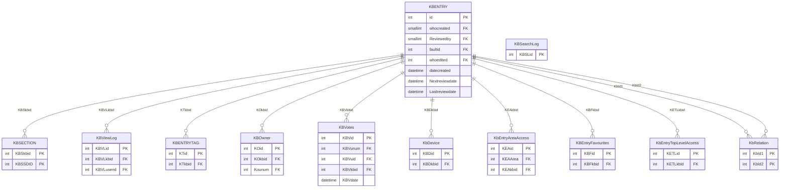

# kb — ERD

Knowledge base articles (**KBENTRY**), FAQs, related links.

12 tables in this domain (showing up to 60 by row count). PK = primary key, FK = foreign key.

```mermaid
erDiagram
    KBSECTION {
        int KBSkbid PK
        int KBSSDID PK
    }
    KBViewLog {
        int KBVLid PK
        int KBVLkbid FK
        int KBVLuserid FK
    }
    KBENTRYTAG {
        int KTid PK
        int KTkbid FK
    }
    KBENTRY {
        int id PK
        smallint whocreated FK
        smallint Reviewedby FK
        int faultid FK
        int whoedited FK
        datetime datecreated
        datetime Nextreviewdate
        datetime Lastreviewdate
    }
    KBOwner {
        int KOid PK
        int KOkbid FK
        int Kounum FK
    }
    KBVotes {
        int KBVid PK
        int KBVunum FK
        int KBVuid FK
        int KBVkbid FK
        datetime KBVdate
    }
    KbDevice {
        int KBDid PK
        int KBDkbid FK
    }
    KbEntryAreaAccess {
        int KEAid PK
        int KEAArea FK
        int KEAkbid FK
    }
    KBEntryFavourites {
        int KBFid PK
        int KBFkbid FK
    }
    KbEntryTopLevelAccess {
        int KETLid PK
        int KETLkbid FK
    }
    KbRelation {
        int KbId1 PK
        int KbId2 PK
    }
    KBSearchLog {
        int KBSLid PK
    }
    KBENTRY ||--o{ KBSECTION : "KBSkbid"
    KBENTRY ||--o{ KBViewLog : "KBVLkbid"
    KBENTRY ||--o{ KBENTRYTAG : "KTkbid"
    KBENTRY ||--o{ KBOwner : "KOkbid"
    KBENTRY ||--o{ KBVotes : "KBVkbid"
    KBENTRY ||--o{ KbDevice : "KBDkbid"
    KBENTRY ||--o{ KbEntryAreaAccess : "KEAkbid"
    KBENTRY ||--o{ KBEntryFavourites : "KBFkbid"
    KBENTRY ||--o{ KbEntryTopLevelAccess : "KETLkbid"
    KBENTRY ||--o{ KbRelation : "KbId1"
    KBENTRY ||--o{ KbRelation : "KbId2"
```
