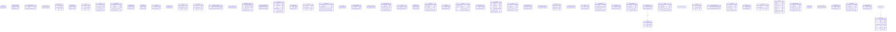

# other — ERD

Miscellaneous tables that didn't match domain rules.

325 tables in this domain (showing up to 60 by row count). PK = primary key, FK = foreign key.

```mermaid
erDiagram
    SQLTime {
        int TID PK
    }
    AIAssistantRequest {
        int AARid PK
        int AARStatus
    }
    CATEGORYDETAIL {
        int CDid PK
        nvarchar CDCategoryName
    }
    LoginScreenConfig {
        int LSCid PK
    }
    QVQUERYFIELDS {
        int Qseq PK
        nvarchar Qkind PK
        int Qid PK
    }
    GEOCOORD {
        int GCid PK
        int GCunum FK
    }
    ViewLists {
        int VLid PK
        int VLunum FK
        nvarchar VLdesc
    }
    QVFIELD {
        int Yseq PK
        nvarchar Yname
        nvarchar Yvalidate
        nvarchar Ydesc
    }
    SQLIMPORTFIELD {
        int SIFid PK
        int SIFsiid FK
        nvarchar SIFthirdpartyname
        nvarchar SIFnhdname
    }
    UserDepartment {
        int UDid PK
        int UDuid FK
    }
    QVLOOKUP {
        int fid PK
        int fcode PK
    }
    TABNAME {
        int TNid PK
        nvarchar TNName
    }
    RESTRICTION {
        int RSid PK
    }
    TSTATUS {
        smallint Tstatus PK
        nvarchar tstatusdesc
        nvarchar tshortname
    }
    CUSTOMTABLE {
        int CTid2 PK
        nvarchar CTName
        nvarchar CTDBName
    }
    CTNinjaOneScriptLibrary {
        int CTNinjaOneScriptLibraryid PK
        nvarchar CFNinjaOneScriptName
    }
    TIME {
        datetime Time1 PK
    }
    NEWREQUESTCONFIG {
        int NRRequestType PK
        int NRFieldId PK
        nvarchar nrfieldname
        nvarchar NrFieldDesc
    }
    SERVSTATUS {
        int sssitenum FK
        int ssid FK
        int SSfaultid FK
        uniqueidentifier ssuniqueid PK
        datetime ssdate
        int ssstatus
        ntext sslastemail
    }
    ServiceCategoryMapping {
        int svcmserviceid PK
        int svcmcategoryid PK
    }
    SERVSITE {
        int starea PK
        int stsitenum PK
        int stid PK
        nvarchar stdesc
        bit STTrackStatus
        bit STautoemail
    }
    OidcImplicitState {
        int id PK
        datetime date
    }
    ItemGroup {
        int IGid PK
        nvarchar IGname
        nvarchar ignominalcode
    }
    dashboardlinks {
        int DBLid PK
        nvarchar DBLname
        datetime DBLreportingperiodstartdate
        datetime DBLreportingperiodenddate
    }
    LDAPNAME {
        int LDAPid PK
    }
    TABLEDEFINITION {
        int tbid PK
        nvarchar tbtablename
    }
    ServiceRequestDetails {
        int SRDid PK
    }
    UserDashboardButtons {
        int UDBid PK
        nvarchar UDBname
        nvarchar udbpagetitle
        nvarchar udbpagedesc
    }
    Control5 {
        bigint SettingId PK
        nvarchar SettingName
    }
    QVQUERY {
        int Srcseq PK
        int QSQLid FK
        nvarchar Srcdesc
    }
    SERVICEUSER {
        int SUid PK
        int SUUid FK
    }
    GENERIC {
        smallint Ggeneric PK
        nvarchar gdesc
        nvarchar gnominalcode
        nvarchar gavalaraitemcode
    }
    TEMPDATA {
        int TDID PK
        datetime TDDate
    }
    POLICY {
        uniqueidentifier ID PK
        nvarchar Pdesc
        bit pSetFixToStartDate
        bit pSetFixToTargetDate
    }
    RICHTEXTDATA {
        int RTXid PK
        nvarchar RTXDesc
    }
    JOURNEY {
        int JOid PK
        int JOUnum FK
        int JOFaultid FK
        int JOActionNumber FK
        datetime JOStartDate
        datetime JOEndDate
    }
    Licence {
        int LID PK
        nvarchar LDesc
        datetime LPurchaseDate
        datetime LDueDate
    }
    PORTALLOGTYPE {
        tinyint PLTID PK
        varchar PLTDesc
    }
    SERVICERESTRICTION {
        int SVRid PK
    }
    USERANALYZER {
        int USAPuid FK
        int usapaarea FK
        int usapssitenum FK
    }
    SECURITYQUESTION {
        int SQid PK
    }
    SERV {
        int svid PK
        nvarchar svdesc
    }
    SECTIONDETAIL {
        int SDid PK
        nvarchar SDSectionName
        nvarchar sdmainemail
        nvarchar sdphonenumber
    }
    ViewListGroup {
        int VLGid PK
        nvarchar VLGname
    }
    SERVICECATALOG {
        int SGid PK
        nvarchar SGdesc
        datetime SGDateCreated
        int SGWhoCreated
    }
    QVQUERYSQL {
        int QSQLid PK
        nvarchar QSQLDesc
    }
    TREE {
        int Treeid PK
        nvarchar TreeDesc
        nvarchar TreeKashFlowUsername
        int tquoteprofitcurrencycode
    }
    UserDashboardRestrictions {
    }
    UVIEWDESC {
        int UVUserID PK
        int UVviewid PK
        nvarchar UVDesc
    }
    CTNCentralScriptLibrary {
        int CTNCentralScriptLibraryid PK
        nvarchar CFAutomationPolicyName
    }
    SetupTab {
        int STid PK
        nvarchar STtitle
        nvarchar STsubtitle
        nvarchar STfaiconname
    }
    WORKDAYS {
        int Wdid PK
        nvarchar Wdesc
    }
    AiSuggestion {
        int AISid PK
        nvarchar AISname
        int AISconditionnumber
    }
    Mention {
        int Mid PK
        int MFaultid FK
        int MActionNumber FK
        int Munum FK
        int muserid FK
        int MnotificationStatus
        int mnotenumber
    }
    SERVICECATEGORY {
        int SVCid PK
        nvarchar SVCdesc
        nvarchar svcphonenumber
        nvarchar svcportaldesc
    }
    UserPrefs {
        int id PK
    }
    DataProtectionKeys {
        nvarchar FriendlyName
    }
    RELEASETYPE {
        int RLTid PK
        nvarchar RLTdesc
    }
    SQLIMPORT {
        int SIid PK
        nvarchar SIdesc
        datetime SIlastrundate
        nvarchar SISQLUsername
    }
    COSTCENTRES {
        int CCID PK
        nvarchar CCName
    }
    SERVERSTATUS ||--o{ SERVSTATUS : "ssid"
    QVQUERYSQL ||--o{ QVQUERY : "QSQLid"
```
