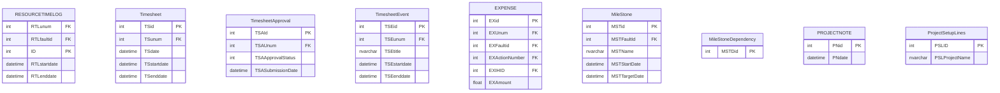

# projects — ERD

Project plans, phases, milestones, risk register.

9 tables in this domain (showing up to 60 by row count). PK = primary key, FK = foreign key.

```mermaid
erDiagram
    RESOURCETIMELOG {
        int RTLunum FK
        int RTLfaultid FK
        int ID PK
        datetime RTLstartdate
        datetime RTLenddate
    }
    Timesheet {
        int TSid PK
        int TSunum FK
        datetime TSdate
        datetime TSstartdate
        datetime TSenddate
    }
    TimesheetApproval {
        int TSAId PK
        int TSAUnum FK
        int TSAApprovalStatus
        datetime TSASubmissionDate
    }
    TimesheetEvent {
        int TSEid PK
        int TSEunum FK
        nvarchar TSEtitle
        datetime TSEstartdate
        datetime TSEenddate
    }
    EXPENSE {
        int EXid PK
        int EXUnum FK
        int EXFaultid FK
        int EXActionNumber FK
        int EXIHID FK
        float EXAmount
    }
    MileStone {
        int MSTid PK
        int MSTFaultId FK
        nvarchar MSTName
        datetime MSTStartDate
        datetime MSTTargetDate
    }
    MileStoneDependency {
        int MSTDid PK
    }
    PROJECTNOTE {
        int PNid PK
        datetime PNdate
    }
    ProjectSetupLines {
        int PSLID PK
        nvarchar PSLProjectName
    }
```
