# tickets — ERD

Tickets / requests. **FAULTS** is the central ticket table; **ACTIONS** holds each update (one row per work-log/email/status change). STDREQUEST = templates, REQUESTTYPE = ticket category.

71 tables in this domain (showing up to 60 by row count). PK = primary key, FK = foreign key.

```mermaid
erDiagram
    ACTIONS {
        int Faultid PK
        int actionnumber PK
        int Achatid FK
        int ActionCode
        nvarchar AUserDesc
        datetime ActionDateCreated
    }
    FAULTS {
        int Faultid PK
        int sitenumber FK
        smallint Assignedtoint FK
        int Areaint FK
        smallint Clearwhoint FK
        int Devsite FK
        int Approvedby FK
        int Requesttype FK
        int FwhoResponded FK
        int Forgid FK
        int RequestTypeNew FK
        int sitenumberoverride FK
        int areaintoverride FK
        int fcontractid FK
    }
    AUDITFAULT {
        int AFid PK
        int AFfaultid FK
        int AFsitenumber FK
        int AFareaint FK
        nvarchar AFsymptom
        nvarchar AFusername
    }
    FaultRuleMatch {
        int FRMid PK
        int FRMFaultId FK
    }
    FEEDBACK {
        int FBID PK
        int FBFaultID FK
        int FBchatId FK
        nvarchar FBUsername
        nvarchar FBEmail
        datetime FBDate
    }
    FaultRuleHistory {
        int FRHid PK
        int FRHfaultid FK
        datetime FRHstartdate
        datetime FRHenddate
    }
    FAULTTODO {
        int FTfaultid PK
        int FTseq PK
        datetime FTStartDate
        datetime FTEndDate
    }
    REQUESTTYPEFIELD {
        int RTFid PK
        bit RTFRestrictUpdate
        bit rtfcopytochildonupdate
        bit rtfcopytoparentonupdate
    }
    FAULTAPPROVAL {
        int FAid PK
        int FAseq PK
        int FAActionNumber FK
        int FAunum FK
        int FACabID FK
        int FAEmailstatus
    }
    StdRequestScheduleOccurrence {
        int id PK
        int stdId FK
        datetime creationDate
        int status
        datetime nextRetryDate
    }
    STDTODO {
        int TDid PK
        int TDseq PK
    }
    FaultMerge {
        int FMid PK
        int FMfaultid FK
        int FMoldStatus
    }
    STDREQUEST {
        int stdid PK
        int stdkbid FK
        int stduserid FK
        ntext stdsymptom
        nvarchar stdusername
        datetime stdlastcreated
    }
    FaultAdditionalAgents {
        int FAAFaultid PK
        int FAAUnum PK
    }
    TOUTCOME {
        int Oid PK
        smallint Onewstatus
        nvarchar OUserDesc
        int OSendEmail
    }
    FaultBudget {
        int FBTid PK
        int FBTfaultid FK
        int FBTbtid FK
    }
    FaultWatch {
        int FWfaultid FK
        int FWunum FK
        int fwid PK
        nvarchar fwemail
    }
    FaultsTimeEntry {
        int FTEID PK
        int FTEFaultID FK
        int FTEActionCode
    }
    FaultsMileStone {
        int FMSid PK
        int FMSFaultid FK
    }
    REQUESTTYPE {
        int RTid PK
        nvarchar rtdesc
        int RTDefInitialStatus
        bit RTcalcFixbydate
    }
    REQUESTTYPESTATUS {
        int RTSRTID PK
        int RTSTStatus PK
    }
    ActionReaction {
        int ARfaultid PK
        int ARactionnumber PK
        int ARunum PK
    }
    FAQLISTDET {
        int FAQDid PK
        int FAQDkbid PK
    }
    STDREQUESTCHILDREN {
        int TCParentId PK
        int TCChildId PK
    }
    ACTYPE {
        int Actypenum PK
    }
    STDREQUESTRULE {
        int TRid PK
        int TRapprovalstatus
    }
    FAQLISTHEAD {
        int FAQid PK
        nvarchar FAQListDesc
    }
    STDLIST {
        int STDID FK
        int STDLuserid FK
        nvarchar STDLUsername
    }
    TicketArea {
        int TAid FK
        nvarchar TAname
        bit TAgroupagentsbystatus
    }
    FAULTSERVICE {
        int FSfaultid FK
        int fsstdid FK
        int fsid PK
    }
    STDrequestbudget {
        int STBid PK
        int STBstdid FK
    }
    ACT {
        int actID PK
    }
    ACTARC {
        int Faultid PK
        int actionnumber PK
        int ActionCode
        nvarchar AUserDesc
        datetime ActionDateCreated
    }
    ActionRead {
        int ARid PK
        int ARFaultID FK
    }
    AiSuggestionFault {
        int AISFid PK
        int AISFfaultid FK
        datetime AISFappliedDate
    }
    FAQCLIENT {
        int FAQCid PK
        int FAQCarea PK
    }
    FAQCompany {
        int FAQCompanyfaqid PK
        int FAQCompanycnum PK
    }
    FAQOrg {
        int FOorgid PK
        int FOfaqlistid PK
    }
    FaqRequestType {
        int frtid PK
    }
    FAQRole {
        int FAQRid PK
    }
    FAQSite {
        int FAQSid PK
        int FAQSsiteid PK
    }
    FAQStd {
        int FSStdid PK
        int FSFAQid PK
    }
    FAULTARC {
        int Faultid PK
        int sitenumber FK
        smallint Assignedtoint FK
        int Areaint FK
        smallint Clearwhoint FK
        smallint Devsite FK
        int Approvedby FK
        int Requesttype FK
        int FwhoResponded FK
        int Forgid FK
        int RequestTypeNew FK
        int FTemplateParentID FK
        int FTemplateChildID FK
        int FMergedIntoFaultid FK
    }
    FAULTBOOKMARKS {
        int FBID PK
        int FBUnum FK
        int FBFaultID FK
        int FBStatus
    }
    FaultChat {
        int FCid PK
        int FCfaultid FK
        int FCchatid FK
    }
    FaultCommit {
        int FCfaultid FK
        nvarchar FCname
    }
    FAULTDEVICE {
        int FDfaultid PK
        int FDsiteid PK
        int FDdevnum PK
    }
    FaultDraft {
        int FDid PK
        int FDuid FK
    }
    FAULTITEM {
        int FLid PK
        int FLseq PK
        int FLUnum FK
        nvarchar FLstatus
        nvarchar FLdesc
    }
    FaultKbRelation {
        int Faultid PK
        int KbId PK
    }
    FaultNotes {
        int FNid PK
        int FNfaultid FK
        int FNunum FK
        int FNuid FK
    }
    FaultOLA {
        int FOid PK
        int FOfaultid FK
        datetime FOtargetdate
        int FOstatus
        datetime fostartdate
    }
    FaultOLADates {
        int FODid PK
        datetime FODstartdate
        datetime FODenddate
    }
    Faults_Metadata {
        bigint Faultid PK
    }
    FaultsDateDependencies {
        int FDDID PK
        int FDDFaultId FK
    }
    FaultsForecasting {
        int FFCid PK
        int FFCUnum FK
        int FFCFaultId FK
        datetime FFCDate
    }
    FaultsViewLog {
        int FVLid PK
        int FVLfaultid FK
        int FVLunum FK
        int FVLuserid FK
    }
    FaultVector {
        int FVid PK
        int FVfaultid FK
    }
    FaultVectorScore {
        int FVSid PK
        int FVSfaultid FK
    }
    FaultVotes {
        int FVid PK
        int FVunum FK
        int FVuid FK
        int FVfaultid FK
    }
    FAULTS ||--o{ ACTIONS : "Faultid"
    REQUESTTYPE ||--o{ FAULTS : "Requesttype"
    REQUESTTYPE ||--o{ FAULTS : "RequestTypeNew"
    STDREQUEST ||--o{ FAULTS : "fTemplateID"
    FAULTS ||--o{ AUDITFAULT : "AFfaultid"
    FAULTS ||--o{ FaultRuleMatch : "FRMFaultId"
    FAULTS ||--o{ FEEDBACK : "FBFaultID"
    FAULTS ||--o{ FaultRuleHistory : "FRHfaultid"
    FAULTS ||--o{ FAULTTODO : "FTfaultid"
    ACTIONS ||--o{ FAULTAPPROVAL : "FAActionNumber"
    STDREQUEST ||--o{ StdRequestScheduleOccurrence : "stdId"
    FAULTS ||--o{ FaultMerge : "FMfaultid"
    FAULTS ||--o{ FaultAdditionalAgents : "FAAFaultid"
    FAULTS ||--o{ FaultBudget : "FBTfaultid"
    FAULTS ||--o{ FaultWatch : "FWfaultid"
    FAULTS ||--o{ FaultsTimeEntry : "FTEFaultID"
    FAULTS ||--o{ FaultsMileStone : "FMSFaultid"
    FAULTS ||--o{ ActionReaction : "ARfaultid"
    ACTIONS ||--o{ ActionReaction : "ARactionnumber"
    STDREQUEST ||--o{ STDLIST : "STDID"
    FAULTS ||--o{ FAULTSERVICE : "FSfaultid"
    STDREQUEST ||--o{ FAULTSERVICE : "fsstdid"
    STDREQUEST ||--o{ STDrequestbudget : "STBstdid"
    FAULTS ||--o{ ACTARC : "Faultid"
    ACTIONS ||--o{ ACTARC : "actionnumber"
    FAULTS ||--o{ ActionRead : "ARFaultID"
    FAULTS ||--o{ AiSuggestionFault : "AISFfaultid"
    FAQLISTHEAD ||--o{ FAQStd : "FSFAQid"
    STDREQUEST ||--o{ FAQStd : "FSStdid"
    REQUESTTYPE ||--o{ FAULTARC : "Requesttype"
    REQUESTTYPE ||--o{ FAULTARC : "RequestTypeNew"
    FAULTS ||--o{ FAULTARC : "FTemplateParentID"
    FAULTS ||--o{ FAULTARC : "FTemplateChildID"
    FAULTS ||--o{ FAULTARC : "FMergedIntoFaultid"
    FAULTS ||--o{ FAULTBOOKMARKS : "FBFaultID"
    FAULTS ||--o{ FaultChat : "FCfaultid"
    FAULTS ||--o{ FaultCommit : "FCfaultid"
    FAULTS ||--o{ FAULTDEVICE : "FDfaultid"
    FAULTS ||--o{ FaultKbRelation : "Faultid"
    FAULTS ||--o{ FaultNotes : "FNfaultid"
    FAULTS ||--o{ FaultOLA : "FOfaultid"
    FAULTS ||--o{ FaultsDateDependencies : "FDDFaultId"
    FAULTS ||--o{ FaultsForecasting : "FFCFaultId"
    FAULTS ||--o{ FaultsViewLog : "FVLfaultid"
    FAULTS ||--o{ FaultVector : "FVfaultid"
    FAULTS ||--o{ FaultVectorScore : "FVSfaultid"
    FAULTS ||--o{ FaultVotes : "FVfaultid"
```

