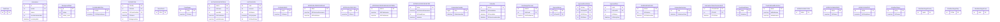

# workflow — ERD

Approval processes, auto-assign, workflows, schedules, matching rules.

32 tables in this domain (showing up to 60 by row count). PK = primary key, FK = foreign key.

```mermaid
erDiagram
    TaskTrace {
        int id PK
    }
    Automation {
        int id PK
        int faultid FK
        int status
        int resultactionnumber
        datetime nextretrydate
    }
    BackgroundTask {
        int id PK
        int status
        int status_code
    }
    FLOWSUBDETAIL {
        int FSDID PK
        nvarchar FSDOptionName
    }
    FLOWDETAIL {
        int FDSEQ PK
        int FDFHID PK
        nvarchar FDChatProfileId PK
        nvarchar FDName
        int fdstagenumber
    }
    RaceCheck {
        int RCid PK
    }
    FlowStages {
        int FSid PK
        nvarchar FSdesc
    }
    AUTOASSIGNCRITERIA {
        int AACid PK
        int AACauid FK
        int aacstdid FK
        nvarchar AACfieldname
        nvarchar aactablename
    }
    AUTOASSIGN {
        int auid PK
        int auunum FK
        int AUStatus
        nvarchar AUSymptom
        int AUNewStatus
    }
    FLOWHEADER {
        int FHID PK
        nvarchar FHName
    }
    APPROVALPROCESSRULE {
        int ARid PK
        nvarchar ARSelectedUsername
        nvarchar ARRuleName
    }
    APPROVALPROCESS {
        int APid PK
        nvarchar APdesc
    }
    APPROVALPROCESSRULECRITERIA {
        int ARCid PK
        nvarchar ARCtablename
        nvarchar ARCfieldname
    }
    APPROVALPROCESSSTEP {
        int ASid PK
        nvarchar ASSelectedUsername
        bit ASSendEmail
        nvarchar asname
    }
    AutomationVariable {
        bigint AVid PK
        datetime AVdeletiondate
    }
    Schedule {
        int SCHid PK
        datetime SCHstartdate
        datetime SCHenddate
        datetime SCHnextcreationdate
    }
    AutoAssignOutcome {
        int AAOid PK
        int AAOauid FK
        nvarchar AAOfieldname
    }
    ApprovalItems {
        int AISeq PK
        int AIFaultID PK
    }
    ApprovalItemsStatus {
        int AISSeq PK
        int AISFaultID PK
        int AISFASeq PK
        int AISStatus PK
    }
    ApprovalStore {
        int ASID PK
        int ASFaultID FK
        int ASStatus
        datetime ASRetryDate
    }
    ASSIGNSCHEDULE {
        int ASSid PK
        int ASSstatus
        datetime ASSlastrundate
    }
    AutomationIteration {
        int AIid PK
        datetime AIdeletionDate
    }
    AutomationTicketCreationAudit {
        int ATCASTDID PK
        int ATCAID PK
        datetime ATCADate
    }
    FlowDetailStatus {
        int fdsid PK
        int fdsstatus
    }
    FlowSubDetailRestriction {
        int fsdrid PK
        nvarchar fsdfieldname
        nvarchar fsdtablename
    }
    WORKFLOWACTION {
        int WAid PK
    }
    WORKFLOWHEADER {
        int WFid PK
        nvarchar WFName
    }
    WORKFLOWSTEP {
        int WSid PK
        nvarchar WSStepName
    }
    WorkflowTarget {
        int WTid PK
        nvarchar WTname
    }
    WorkflowTargetPriority {
        int wtpid PK
    }
    WorkflowTargetStep {
        int WTsid PK
    }
    WorkflowTargetTeam {
        int wttid PK
    }
```
